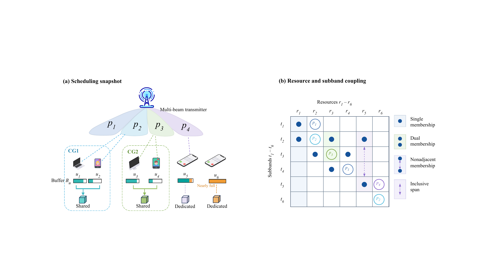
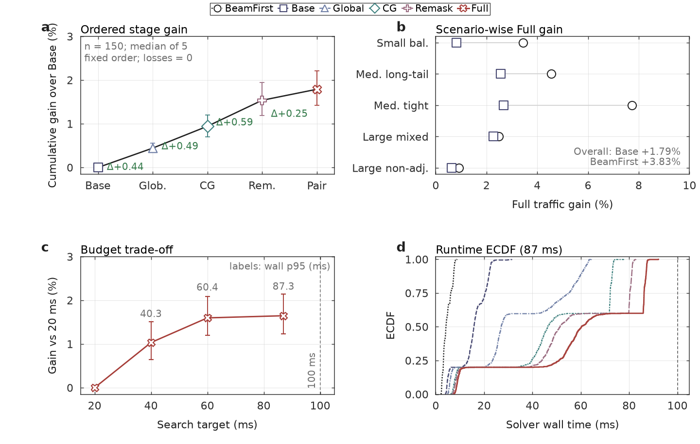
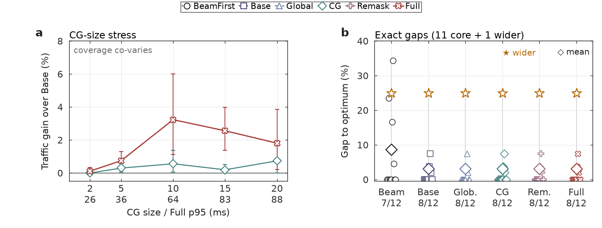

<p align="center">
  <strong>English</strong> · <a href="README.zh-CN.md">简体中文</a>
</p>

<h1 align="center">FPTR Joint Beam and Resource Scheduler</h1>

<p align="center">
  <strong>Deadline-aware wireless scheduling with feasibility-preserving transactional refinement</strong><br>
  A code-only C++17/Python release for joint beam planning, resource allocation, validation, experiments, and figure generation.
</p>

<p align="center">
  <a href="https://isocpp.org/"></a>
  <a href="https://www.python.org/"></a>
  <a href="#validation"></a>
</p>

<p align="center">
  <a href="#overview">Overview</a> ·
  <a href="#method">Method</a> ·
  <a href="#visual-summary">Figures</a> ·
  <a href="#quick-start">Quick Start</a> ·
  <a href="#experiments">Experiments</a> ·
  <a href="#appendices">Appendices</a> ·
  <a href="#repository-map">Repository</a>
</p>

<a id="overview"></a>
## Overview

FPTR, short for Feasibility-Preserving Transactional Refinement, is a single-threaded heuristic scheduler for deadline-constrained joint beam and resource allocation. It keeps a releasable feasible incumbent at all times, builds each refinement candidate in private state, and commits a candidate only when it is complete, timely, structurally valid, and strictly better in transmitted traffic.

| Goal | Implementation | Public evidence path |
| --- | --- | --- |
| Return a legal allocation under tight deadlines | Empty-allocation fallback plus anytime feasible incumbent | Independent Python parser, validator, and score recomputation |
| Improve transmitted traffic under coupled constraints | Cumulative FPTR stages from `Base` to `Full` | Stage traces and reproducible synthetic experiment harness |
| Keep experiment outputs auditable | Explicit output paths under ignored local directories | Unit tests, quick integration run, and figure-generation scripts |

The scheduler reads one allocation instance from standard input and writes the allocation contract to standard output. Optional traces go to standard error, so diagnostics do not change the solution format.

<a id="method"></a>
## Method

Resource capacities, user buffers, beam masks, compatibility groups, link adaptation, and deadlines are coupled. FPTR handles that coupling through cumulative stages:

| Stage | Role |
| --- | --- |
| `BeamFirst` | Independent aggregate-mask reference method |
| `Base` | Diversified-mask feasible construction |
| `Global` | Buffer-aware marginal repricing |
| `CG` | Compatibility-group-aware legal sharing |
| `Remask` | Residual-demand mask repair |
| `Full` | Two-resource ruin-and-recreate after the preceding stages |

Across stages, the commit rule is the same: rejected, expired, incomplete, or infeasible candidates cannot modify the incumbent.

<a id="visual-summary"></a>
## Visual Summary

<p align="center">
  <a href="docs/images/scenario_constraint_coupling.png">
    
  </a>
</p>
<p align="center"><em>Figure 1 | Resource capacities, demands, masks, sharing groups, link adaptation, and deadlines define the coupled scheduling instance.</em></p>

<p align="center">
  <a href="https://github.com/rudykon/FPTR_Scheduler/blob/main/docs/images/Deadline_Aware_FPTR_Scheduler.pdf">
    
  </a>
</p>
<p align="center"><em>Figure 2 | Each bounded refinement stage builds a private candidate and reaches the incumbent only through commit-or-discard validation.</em></p>

<details>
<summary><strong>Open result and stress-test figures</strong></summary>
<br>

<p align="center">
  <a href="docs/images/results_quality_runtime.png">
    
  </a>
</p>
<p align="center"><em>Figure 3 | Cumulative refinement improves allocation quality under the online runtime budget.</em></p>

<p align="center">
  <a href="docs/images/results_stress_optimality.png">
    
  </a>
</p>
<p align="center"><em>Figure 4 | Stress tests evaluate deadline robustness, while exact small-instance comparisons calibrate quality against optimum.</em></p>

</details>

<a id="quick-start"></a>
## Quick Start

```bash
git clone https://github.com/rudykon/FPTR_Scheduler.git
cd FPTR_Scheduler

g++ -std=c++17 -O2 src/scheduler.cpp src/core.cpp -o scheduler
./scheduler --help
```

Run the full cumulative scheduler on one instance:

```bash
./scheduler --stage full --budget-ms 87 < instance.in
```

Use `--trace` to inspect cumulative stages without changing the allocation written to standard output:

```bash
./scheduler --stage full --budget-ms 87 --trace < instance.in > allocation.out
```

<a id="validation"></a>
## Validation

```bash
python3 -m unittest discover -s tests -v
```

The tests compile the C++ scheduler in a temporary directory and check the parser, feasibility rules, link adaptation, compatibility-group sharing, cumulative-stage traces, and exact-audit helpers.

For independent validation of produced allocations, use:

```bash
python3 tools/scheduler_validator.py --help
```

<a id="experiments"></a>
## Experiments

Pass explicit output paths when running experiment scripts so generated artifacts remain in the chosen local directory.

Quick integration run:

```bash
python3 experiments/paper_experiments.py \
  --quick \
  --out /tmp/fptr-quick-results
```

Example full protocol writing to an ignored local directory:

```bash
python3 experiments/paper_experiments.py \
  --experiments main,budget,stress,exact \
  --seeds-per-scenario 30 \
  --repeats 5 \
  --stress-seeds 10 \
  --exact-cases 12 \
  --main-budget-ms 87 \
  --budgets 20,40,60,87 \
  --stress-methods Base,CG,Full \
  --deadline-ms 100 \
  --timeout-ms 500 \
  --bootstrap-samples 5000 \
  --bootstrap-seed 20260722 \
  --out artifacts/results
```

Regenerate explanatory and quantitative figures:

```bash
python3 -m pip install -r requirements-figures.txt
python3 experiments/plot_scheduler_pipeline.py \
  --output artifacts/figures/scheduler_pipeline
python3 experiments/plot_paper_results.py \
  --results-dir artifacts/results \
  --output-dir artifacts/figures
```

Generated results and figures belong under `artifacts/`, which is ignored by Git.

<a id="appendices"></a>
## Standalone Evidence Appendices

The public release also provides two standalone evidence appendices:

- [English Appendix (PDF)](docs/appendices/Appendix.pdf)
- [Chinese Appendix (PDF)](docs/appendices/Appendix_zh.pdf)

They summarize execution accounting, external-baseline comparisons, exact calibration, and artifact integrity. The main manuscript and literature files remain outside this code-focused release.

<a id="repository-map"></a>
## Repository Map

| Path | Purpose |
| --- | --- |
| `src/` | C++17 scheduler implementation, shared model, and stage entry points |
| `tools/scheduler_validator.py` | Independent parser, feasibility validator, and objective recomputation |
| `tools/audit_exact_suite.py` | Independent exact-audit workflow for externally supplied result artifacts |
| `experiments/` | Deterministic instance generation, experiment orchestration, analysis, and plotting |
| `tests/` | Validator, model-contract, scheduler, and release-helper regression tests |
| `docs/images/` | Approved explanatory and result figures for the public README |
| `PROJECT_OVERVIEW.md` | Compact model, algorithm, and component overview |
