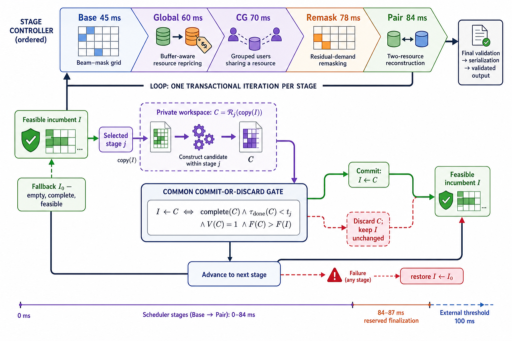

# FPTR Joint Beam and Resource Scheduler

**English** | [简体中文](README.zh-CN.md)

This is the code-only public release of **FPTR (Feasibility-Preserving Transactional Refinement)** for deadline-constrained joint beam and resource allocation.

The manuscript text, compiled papers, third-party literature PDFs, and sealed experimental artifacts remain excluded from this repository. This public release includes only the source tree, project documentation, and the four approved explanatory figures below.

## Method overview

The single-threaded C++17 scheduler maintains a feasible incumbent while bounded refinement stages construct private candidates. A candidate is committed only when it is complete, timely, structurally valid, and strictly improves the objective; otherwise it is discarded without changing the incumbent.

The cumulative stages are:

1. `BeamFirst`: independent aggregate-mask reference;
2. `Base`: diversified-mask feasible construction;
3. `Global`: buffer-aware marginal repricing;
4. `CG`: compatibility-group-aware legal sharing;
5. `Remask`: residual-demand mask repair;
6. `Full`: two-resource ruin-and-recreate after all preceding stages.

## Visual overview

### Problem scenario and coupled constraints

Resource capacities, user demands, beam masks, compatibility groups, link adaptation, and deadlines form a tightly coupled scheduling problem.


### Feasibility-preserving release path

Each bounded refinement stage constructs a private candidate. A shared commit-or-discard rule protects the incumbent and provides an anytime-feasible release path.



### Quality and runtime

The main evaluation summarizes how cumulative refinement improves allocation quality under the online runtime budget.


### Stress tests and optimality calibration

Stress scenarios evaluate deadline robustness, while exact small-instance comparisons calibrate solution quality against the optimum.


## Repository layout

- `src/`: C++17 scheduler implementation and stage wrappers;
- `experiments/`: instance generation, experiment orchestration, analysis, and plotting code;
- `tools/scheduler_validator.py`: independent parser, feasibility validator, and objective recomputation;
- `tools/audit_exact_suite.py`: independent exact-audit workflow for externally supplied result artifacts;
- `tools/check_paper_release.py`: release-checking utility retained for reproducibility workflows;
- `tests/`: validator, model-contract, scheduler, and utility regression tests;
- `PROJECT_OVERVIEW.md`: model, algorithm, and component overview.

## Build the scheduler

```bash
g++ -std=c++17 -O2 src/scheduler.cpp src/core.cpp -o scheduler
```

The executable reads one scheduling instance from standard input. Select a cumulative stage and time budget with, for example:

```bash
./scheduler --stage full --budget-ms 87 < instance.in
```

Use `--trace` to write stage diagnostics to standard error without changing the allocation on standard output.

## Run tests

```bash
python3 -m unittest discover -s tests -v
```

The tests compile the scheduler in a temporary directory and validate the input contract, feasibility rules, link adaptation, compatibility-group sharing, cumulative-stage traces, and release-checking helpers.

## Run experiments

Some experiment scripts retain historical `paper/...` defaults. Because manuscript artifacts are not part of this public repository, pass explicit output paths.

Quick integration run:

```bash
python3 experiments/paper_experiments.py \
  --quick \
  --out /tmp/fptr-quick-results
```

Example full protocol outputting to an ignored local directory:

```bash
python3 experiments/paper_experiments.py \
  --experiments main,budget,stress,exact \
  --seeds-per-scenario 30 \
  --repeats 5 \
  --stress-seeds 10 \
  --exact-cases 12 \
  --main-budget-ms 87 \
  --budgets 20,40,60,87 \
  --stress-methods Base,CG,Full \
  --deadline-ms 100 \
  --timeout-ms 500 \
  --bootstrap-samples 5000 \
  --bootstrap-seed 20260722 \
  --out artifacts/results
```

## Generate figures

```bash
python3 -m pip install -r requirements-figures.txt
python3 experiments/plot_scheduler_pipeline.py \
  --output artifacts/figures/scheduler_pipeline
python3 experiments/plot_paper_results.py \
  --results-dir artifacts/results \
  --output-dir artifacts/figures
```

Generated results and figures belong under `artifacts/`, which is ignored by Git.
