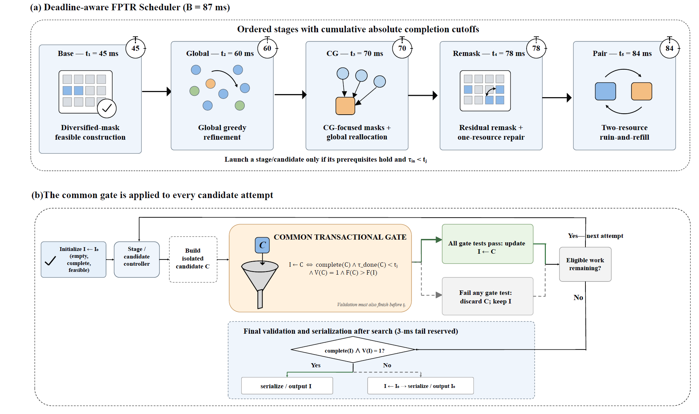

# FPTR Joint Beam and Resource Scheduler

This Space runs the repository's real single-threaded C++17 scheduler. It does not replace FPTR with a browser-side approximation. The bundled scheduler, validator, and scenario generator are synchronized with source commit [`dca2f771`](https://github.com/rudykon/FPTR_Scheduler/commit/dca2f77141c2abd8a4741b229bb9c5f3053792ec).

Choose one of the five deterministic public scenario families—or upload a valid scheduler input—to inspect:

- cumulative `Base → Global → CG → Remask → Full` incumbent gains;
- the final user–resource allocation and legal multi-user sharing;
- the selected per-subband beam masks;
- per-user delivered and unmet traffic;
- independent feasibility, trace monotonicity, score-consistency, and deadline checks;
- a downloadable audit bundle containing the input, allocation, trace, and run metadata.

The included scenarios are synthetic and are generated by the public experiment harness. They are intended to explain algorithm behavior, not to represent live base-station traffic.

Source: [rudykon/FPTR_Scheduler](https://github.com/rudykon/FPTR_Scheduler)
